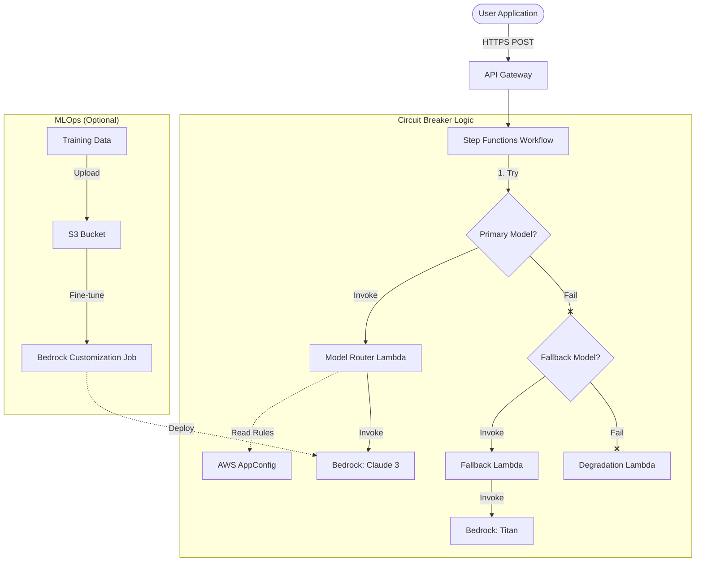

# AWS Customer Service AI Assistant

This project implements a resilient, multi-region AI assistant backend using AWS Bedrock, AppConfig, Lambda, API Gateway, and Step Functions.

## Architecture

The system is designed for high availability and dynamic model selection:

1.  **Dynamic Model Selection**: AWS AppConfig is used to configure which Bedrock model is used for different request types (e.g., "general", "finance_deep").
2.  **Circuit Breaker Pattern**: AWS Step Functions orchestrates the model invocation with a fallback mechanism:
    *   **Primary**: Tries to invoke the configured model (e.g., Claude 3 Sonnet).
    *   **Fallback**: If Primary fails, retries with a lighter model (e.g., Titan Text Express).
    *   **Degradation**: If Fallback fails, returns a static system maintenance message.
3.  **Cross-Region Resilience**: The entire stack is deployed to both `us-east-1` (Primary) and `us-west-2` (Secondary) for active-passive failover.
4.  **Model Fine-Tuning (MLOps)**: An optional MLOps workflow using AWS SageMaker and S3 to fine-tune foundation models on domain-specific data, improving performance for specialized financial queries.

### Architecture Diagram



## Project Structure

*   `infrastructure/`: AWS CDK stacks defining the infrastructure.
    *   `service_stack.py`: Main service stack (AppConfig, Lambda, API Gateway, Step Functions).
*   `runtime/`: Lambda function code.
    *   `model_router/`: Main handler for model selection and Bedrock invocation.
    *   `workflow/`: Fallback and degradation handlers.
*   `runtime/benchmark/`: Scripts for benchmarking Bedrock models.

## Deployment

The project is deployed using AWS CDK:

```bash
# Install dependencies
python3 -m venv .venv
source .venv/bin/activate
pip install -r requirements.txt
npm install -g aws-cdk

# Deploy to Primary Region (us-east-1)
npx aws-cdk deploy ServiceStack-Primary

# Deploy to Secondary Region (us-west-2)
npx aws-cdk deploy ServiceStack-Secondary
```

## Usage

Send a POST request to the API Gateway endpoint:

```bash
curl -X POST -H "Content-Type: application/json" \
  -d '{"question":"What is the inflation rate?", "type":"finance_deep"}' \
  <API_ENDPOINT_URL>
```

## Configuration

Model selection is managed via AWS AppConfig > `ModelSelectionApp` > `ModelConfig` profile. Update the JSON configuration to switch models dynamically without redeployment.

## Part 4: Model Fine-tuning (MLOps)

The project includes an optional MLOps stack for managing model fine-tuning and lifecycle.

### 1. Deploy MLOps Infrastructure
Uncomment the `MLOpsStack` instantiation in `app.py`:

```python
MLOpsStack(app, "MLOpsStack",
    env=cdk.Environment(account="...", region="us-east-1"),
)
```

Then deploy:
```bash
npx aws-cdk deploy MLOpsStack
```
This creates an S3 bucket for training data and an IAM role for SageMaker/Bedrock.

### 2. Run Fine-tuning Job
Use the helper script to initiate a Bedrock model customization job:

```bash
# Set environment variables from MLOpsStack outputs
export SAGEMAKER_ROLE_ARN="arn:aws:iam::..." 
export S3_BUCKET_NAME="..."

python3 runtime/ml_ops/start_finetuning.py
```
This script uploads training data (requires `train/dataset.jsonl` in the bucket) and starts a customization job for a foundation model (e.g., Claude 3 or Titan).

